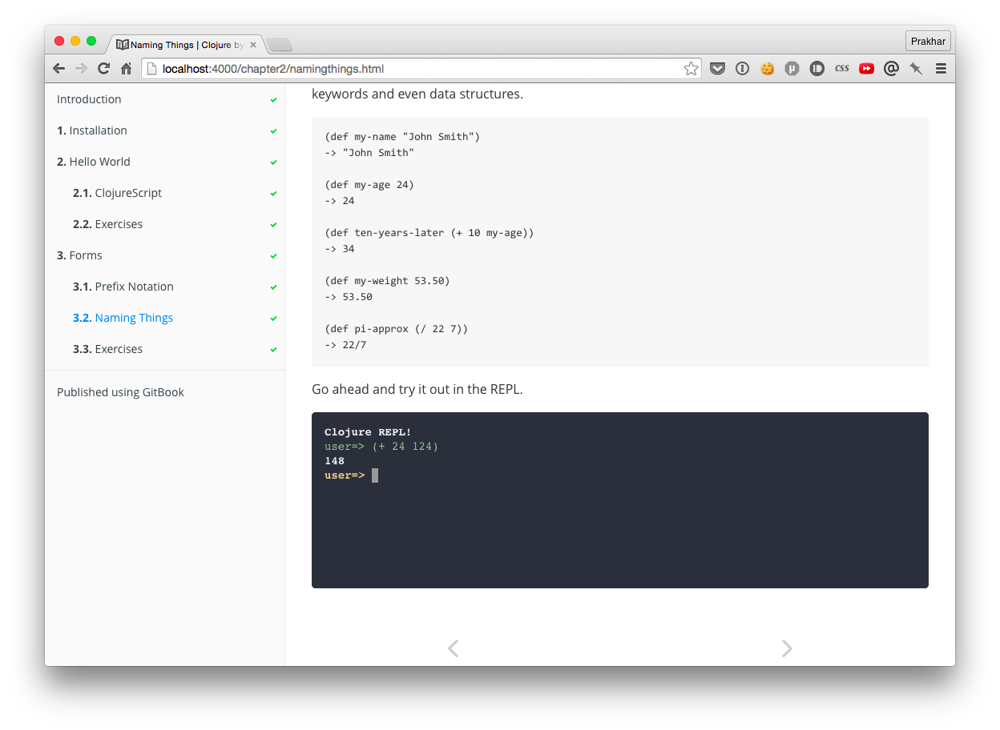

GitBook Plugin - REPL
==============

This is a Gitbook Plugin that allows you to embed a REPL right in your Gitbook! This plugin powers the Clojure REPL used in writing the [Clojure By Example]() guide.



The plugin uses the awesome open-source [jqConsole](https://github.com/replit/jq-console) for embedding a terminal.

### Dependancies
To make this work, you need a running app in the backend to which the REPL will send code via Ajax and get back evaluated result. 

For Clojure you can just fork the [Try Clojure](https://github.com/Raynes/tryclojure) project and host it on Heroku. The plugin can then be customized to use your custom heroku app. 

Note: You will need to customize the Try Clojure noir app so that it can accept cross-domain requests.

### Usage
```javascript
{
  "plugins": ["repl"],
  "pluginsConfig": {
    "repl": { "URL": "http://example-herokuapp.com/eval" }
  }
}
```
