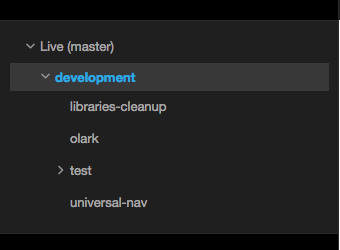

# Platform.sh Environments

An environment is tied to a Git branch, plus all the services that are serving that branch. You can see that as a **complete working website**.

[Platform.sh](https://platform.sh) helps a coder with the development workflow by making it easy to manage multiple environments, including the Master environment which runs the production website.

## Master environment

Every Platform.sh project starts with a Master environment which corresponds to the Master branch in Git.

If you subscribed to a production plan, this environment is your **live site** and can be mapped to a domain name and an SSL certificate.

## Hierarchy



Platform.sh brings the concept of a hierarchy between your environments.
Each new environment you create is considered a **child** of the **parent** environment from which it was branched.

Each child environment can sync code and/or data down from its parent, and merge code up to its parent. These are used for development, staging, and testing.

## Workflows

Since you can organize your environments as you want, you have complete flexibility to create your own workflows.

There are no rules you must follow when branching the master environment. You simply need a structure that best fits your workflow:

-   **Agile**: a child environment per sprint. Each story in the sprint
    can have its own environment as a child of the sprint environment.
-   **Developer-centric**: one QA environment and a few development
    environments (*per developer, per task...*).
-   **Testing**:: an operational test environment, a user test
    environment and a few unit test environments.
-   **Hotfix**: one environment for every bug, security, or hotfix that
    needs deployment.

Here is an example of a possible Agile workflow.


The administrator creates a Sprint environment and gives each of the developers permission to create new feature environments. Another approach is that the administrator could create an environment for each developer.

------------------------------------------------------------------------


As a feature is completed, the administrator can review the work by accessing the website of the feature environment. The new feature is then merged back into the Sprint environment.

------------------------------------------------------------------------


The remaining features will sync with the Sprint environment to ensure their working environment is up-to-date with the latest code.

------------------------------------------------------------------------


When the objectives of the sprint are complete, the administrator can then make a backup of the live site, then merge the Sprint environment into the live (Master) environment.

------------------------------------------------------------------------

The administrator can then synchronize the next sprint's environment with data from the live (Master) environment to repeat and continue the development process.

## Naming conventions

Platform.sh provides great flexibility on the way you can organize and work with your development environments. To improve readability and productivity, it's important to think carefully about how to name and structure those environments.

The name should represent the purpose of the environment. Is it a Staging site to show to your client? Is it an implementation of a new feature? Is it a hotfix?

If you use Agile, for example, you could create hierarchical environments and name them like this:

```bash
Sprint1
  Feature1
   Feature2
   Feature3
Sprint2
  Feature1
  Feature2
  ...
```

If you prefer splitting your environments per developer and having a specific environment per task or per ticket, you could use something like this:

```bash
Staging
  Developer1
    Ticket-526
    Ticket-593
  Developer2
    Ticket-395
  ...
```
