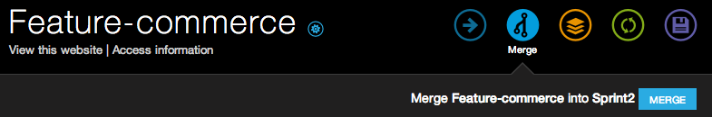

Mastering the Basics - Part 2
=============================

Push changes to an environment
------------------------------
Here, we'll see how to make code changes to an :term:`environment`.

.. note::
  You should never be working on the :term:`Master` branch since it's supposed to be your production environment.

Make sure you're on a working :term:`environment`. In this example we're on the *sprint1* branch:

.. code-block:: console

   $ git branch
   * sprint1

Now that you're set up on your working branch, you can start developing on your website by making code changes and pushing those changes to Platform to test them live.

There are three common ways you will be making code changes to Platform:

1. Add contributed modules, themes, distributions, 3rd party libraries in the :term:`make file`
2. Create custom code (*modules, themes, profiles, libraries*) and commit them to your Platform codebase
3. Modify the services grid configuration

.. seealso::
   * :doc:`/using-platform/001-best-practices`

Add contributed projects
^^^^^^^^^^^^^^^^^^^^^^^^
Each time you push a commit, Platform will rebuild your environment and run the :term:`Drush` make command if a proper make file has been found..

.. seealso::
   * :doc:`/using-platform/007-getting-help`
   * `Working with make files <http://drushmake.me/>`_

Add a Drupal Module
+++++++++++++++++++
Each Drupal module you want to install on your project should be included in the :term:`make file`. For example, if you want to add Drupal Commerce, you need to add the following lines to your ``project.make``:

.. code-block:: ini

  ; Modules
  projects[addressfield][version] = "1.0-beta4"
  projects[addressfield][subdir] = "contrib"

  projects[ctools][version] = "1.3"
  projects[ctools][subdir] = "contrib"

  projects[commerce][version] = "1.8"
  projects[commerce][subdir] = "contrib"

  projects[entity][version] = "1.2"
  projects[entity][subdir] = "contrib"

  projects[rules][version] = "2.6"
  projects[rules][subdir] = "contrib"

  projects[views][version] = "3.7"
  projects[views][subdir] = "contrib"

Add a Drupal Theme
++++++++++++++++++
You'd do the same if you want to add a theme.  Add the following lines to your ``project.make``:

.. code-block:: ini

   ; Zen Theme
   projects[] = zen

Add a 3rd Party Library
+++++++++++++++++++++++
You'd do the same if you want to add a 3rd party library. For our example here, we're adding the HTML5 Boilerplate library. Add the following lines to your ``project.make``:

.. code-block:: ini

   ; Libraries
   libraries[html5bp][download][type] = "file"
   libraries[html5bp][download][url] = "http://github.com/h5bp/html5-boilerplate/zipball/v3.0.2stripped"

Add custom code
^^^^^^^^^^^^^^^
To commit your custom modules, themes or libraries, you need to commit them under a ``modules``, ``themes`` or ``libraries`` folder at the root of your Git repository.

.. code-block:: console

   $ ls
     libraries/
     modules/
     project.make
     themes/

When you push your code, Platform will build your environment and move your modules, themes, libraries to the correct location on your site (usually ``sites/default/``).

Change the services configuration
^^^^^^^^^^^^^^^^^^^^^^^^^^^^^^^^^
You can change and define the topology of the services used in an environment, by modifying the configuration files.

This means that you're able to define and configure the services you want to use.

.. seealso::
  * :doc:`/reference/001-service-grid`

Push your changes
^^^^^^^^^^^^^^^^^
When you're done, commit your changes to test them on your online :term:`environment`.

.. code-block:: console

   $ git add .
   $ git commit -m "Made changes to my make file."
   $ git push

You will see that Platform has found a :term:`make file` and is starting to rebuild your :term:`environment`.

When it's completed, you can see your changes on your site by clicking ``View this website`` under the name of **Sprint1** environment on the :term:`Platform UI`.

.. note::
  * The Drush Make processing doesn't create any file in your Git repository. Your Git repository is the *input* of the process and not the *output*. You can see the directory structure that has been created by connecting via SSH to the :term:`environment`. See the information in the ``Access information`` below the title of the :term:`environment`

Merge code changes to Master
----------------------------
Once you've got a branch with some changes, you'll want to be able to push those changes up to your live environment. Platform has a great button called ``Merge`` that you can click on and it will push the appropriate changes to master.

Just click on the "Merge" button and all of the commits you made on your branch will be merged into the master environment.

.. seealso::
    `Branch an environment <platform/platform-quick-start-guide/001-mastering-the-basics.html#branch-an-environment>`_
