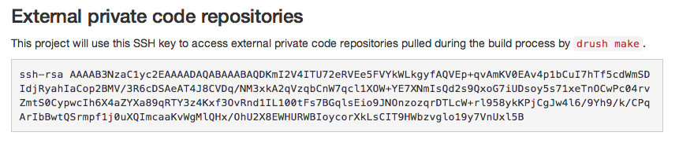

Use private Git repository
==========================

Pull code from a private Git repository
---------------------------------------

Let's say you're building a module (*or theme, library...*) which is stored in a private Git repository that you have access to and want to use it on your project.

Platform allows you to get code that is stored in private Git repository (from your :term:`make file`, or ``composer file``).

   Copy the project public SSH key on the *Access Control* tab of the project configuration screen.

To grant Platform access to your private Git repository, you need to add the project public SSH key in the deploy keys of your Git repository. If your private repository is on Github, go to the target repository's settings page. Go to *Deploy Keys* and click *Add deploy key*. Paste the public SSH key in and submit.

If you're using Drupal for example, you can now use your private module by adding it to your :term:`make file`:

.. code-block:: ini

  ; Add private repository from Github
  projects[module_private][type] = module
  projects[module_private][subdir] = "contrib"
  projects[module_private][download][type] = git
  projects[module_private][download][branch] = dev
  projects[module_private][download][url] = "git@github.com:guguss/module_private.git"

Using multiple private Git repositories
---------------------------------------

Github only allow you to use a deploy key to a single repository. More complex projects may have many repositories to pull to the same server.

If your project needs to access multiple repositories, you can choose to attach an SSH key to an automated user account. Since this account won’t be used by a human, it’s called a machine user. You can then add the machine account as collaborator or add the machine user to a team with access to the repositories it needs to manipulate.

More information about this on `Github <https://developer.github.com/guides/managing-deploy-keys/#machine-users>`_.